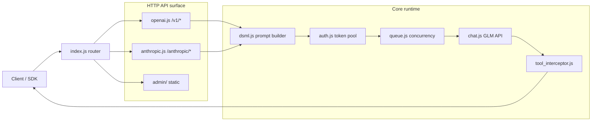

# GLM2API Architecture and Project Structure

Language: [中文](ARCHITECTURE.md) | [English](ARCHITECTURE.en.md)

> This document describes the code directory structure, module boundaries, and main call flow.

## 1. Top-Level Directory Structure

```text
glm2api/
├── src/                          # Core source code
│   ├── index.js                  # Entry, route registration
│   ├── chat.js                   # GLM API interaction (multimodal file upload)
│   ├── openai.js                 # OpenAI compatibility
│   ├── anthropic.js              # Anthropic format support (optional)
│   ├── dsml.js                   # Prompt system core
│   ├── tool_interceptor.js       # Tool call interception and repair
│   ├── auth.js                   # Token management and refresh
│   ├── image.js                  # Image processing
│   ├── queue.js                  # Request queue
│   ├── session.js                # Session management
│   ├── metrics.js                # Performance metrics
│   └── logger.js                 # Logging
├── admin/                        # Admin panel static files
├── docs/                         # Project documentation
├── .env                          # Configuration
├── Dockerfile                    # Docker build
├── docker-compose.yml            # Docker Compose
├── package.json                  # Dependencies
└── README.md                     # Project overview
```

## 2. Request Main Flow



## 3. Core Module Responsibilities

- `index.js`: HTTP server entry, registers routes and middleware.
- `openai.js`: Handles `/v1/chat/completions` and `/v1/models`, converts to internal format.
- `anthropic.js`: Handles Claude-compatible endpoints (optional).
- `chat.js`: Communicates with Zhipu GLM Web API, manages sessions and file uploads.
- `dsml.js`: Builds prompts, compresses tool definitions, cleans history, enforces JSON output.
- `tool_interceptor.js`: Parses tool calls from model output, repairs malformed output.
- `auth.js`: Manages refresh token pool, auto-refresh and health checks.
- `queue.js`: Per-token concurrency control and waiting queue.
- `image.js`: Handles base64 image uploads.
- `session.js`: Session state management.
- `metrics.js`: Performance metrics (TTFB, token speed).
- `logger.js`: Logging.

## 4. Documentation Splitting Strategy

- Overview and quick start: `README.md`
- Architecture and directory: `docs/ARCHITECTURE.md` (this file)
- API reference: `API.md` / `API.en.md`
- Deployment, testing, contributing: `docs/DEPLOY.md`, `docs/TESTING.md`, `docs/CONTRIBUTING.md`
