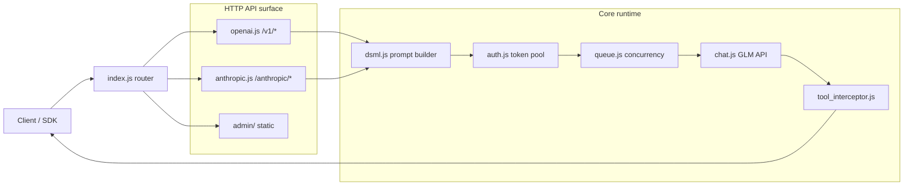

# GLM2API 架构与项目结构说明

语言 / Language: [中文](ARCHITECTURE.md) | [English](ARCHITECTURE.en.md)

> 本文档用于集中维护“代码目录结构 + 模块边界 + 主链路调用关系”。

## 1. 顶层目录结构

```text
glm2api/
├── src/                          # 核心源码
│   ├── index.js                  # 入口，路由注册
│   ├── chat.js                   # 与 GLM API 交互（含多模态文件上传）
│   ├── openai.js                 # OpenAI 兼容处理
│   ├── anthropic.js              # Anthropic 格式支持（可选）
│   ├── dsml.js                   # 提示词系统核心
│   ├── tool_interceptor.js       # 工具调用拦截与修复
│   ├── auth.js                   # 令牌管理与刷新
│   ├── image.js                  # 图片处理
│   ├── queue.js                  # 请求队列
│   ├── session.js                # 会话管理
│   ├── metrics.js                # 性能指标
│   └── logger.js                 # 日志
├── admin/                        # 管理面板静态文件
├── docs/                         # 项目文档
├── .env                          # 配置文件
├── Dockerfile                    # Docker 构建
├── docker-compose.yml            # Docker Compose
├── package.json                  # 项目依赖
└── README.md                     # 项目说明
```

## 2. 请求主链路



## 3. 核心模块职责

- `index.js`：HTTP 服务器入口，注册路由与中间件。
- `openai.js`：处理 `/v1/chat/completions` 与 `/v1/models`，转换为内部格式。
- `anthropic.js`：处理 Claude 兼容端点（可选）。
- `chat.js`：与智谱 GLM Web API 交互，管理会话、文件上传。
- `dsml.js`：构建提示词，压缩工具定义，清理历史，强制 JSON 输出。
- `tool_interceptor.js`：解析模型输出中的工具调用，修复畸形输出。
- `auth.js`：管理 refresh token 池，自动刷新与健康检查。
- `queue.js`：每个 token 的并发控制与等待队列。
- `image.js`：处理 base64 图片上传。
- `session.js`：会话状态管理。
- `metrics.js`：性能指标（TTFB、token 速度）。
- `logger.js`：日志记录。

## 4. 文档拆分策略

- 总览与快速开始：`README.md`
- 架构与目录：`docs/ARCHITECTURE.md`（本文件）
- API 接口：`API.md` / `API.en.md`
- 部署、测试、贡献：`docs/DEPLOY.md`、`docs/TESTING.md`、`docs/CONTRIBUTING.md`
